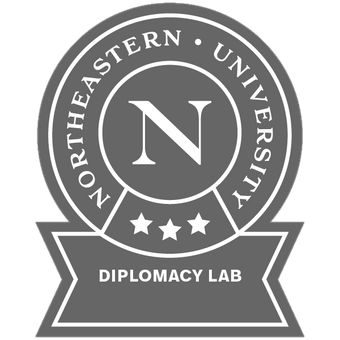

<!-- PROJECT SHIELDS -->
<!--
*** I'm using markdown "reference style" links for readability.
*** Reference links are enclosed in brackets [ ] instead of parentheses ( ).
*** See the bottom of this document for the declaration of the reference variables
*** for contributors-url, forks-url, etc. This is an optional, concise syntax you may use.
*** https://www.markdownguide.org/basic-syntax/#reference-style-links
-->

[![Contributors][contributors-shield]][contributors-url]
[![Forks][forks-shield]][forks-url]
[![Stargazers][stars-shield]][stars-url]
[![Issues][issues-shield]][issues-url]
[][license-url]
[![LinkedIn][linkedin-shield]][linkedin-url]

## Capstone Experiential Network (XN) Project
<!-- PROJECT LOGO -->

  

  

 

  <h3 align="center">Diplomacy Lab Analysis</h3>

  

    This is Final Capstone Experiential Network (XN) Project for ALY6070 - Communication and Visualization for Data Analytics SEC Spring 2021 CPS.  It was primarily to introduce and learn Data Analytics and high level preliminary (Exploratory Data Analysis EDA) analysis using RShiney and Tableau.
     This paper summarizes our preliminary EDA analysis on the provided dataset by the US State Government working with the UN. Here we researched and analyzed a specific area of UN internal committee meetings as requested by a U.S Embassy. We produced recommendations and presented our solutions contributing to the formulation of U.S. foreign policy.
     
    <a href="https://github.com/mascarenhasneil/DiplomacyLab-Analysis/blob/main/Readme.md"><strong>Explore the docs »</strong></a>
     
     
    <a href="https://mascarenhasneil.github.io/DiplomacyLab-Analysis/">View Project</a>
    ·
    <a href="https://github.com/mascarenhasneil/DiplomacyLab-Analysis/issues">Report Bug</a>
    ·
    <a href="https://github.com/mascarenhasneil/DiplomacyLab-Analysis/issues">Request Feature</a>
  

### **Our Paper Presentation Slides**

||||
|-|-|-|
| |||
| |||
| |||
| |||
| |||
| |||
| |||

<!-- MARKDOWN LINKS & IMAGES -->
<!-- https://www.markdownguide.org/basic-syntax/#reference-style-links 
https://github.com/mascarenhasneil/DiplomacyLab-Analysis
-->
[contributors-shield]: https://img.shields.io/github/contributors/mascarenhasneil/DiplomacyLab-Analysis.svg?style=flat-square
[contributors-url]: https://github.com/mascarenhasneil/DiplomacyLab-Analysis/graphs/contributors
[forks-shield]: https://img.shields.io/github/forks/mascarenhasneil/DiplomacyLab-Analysis.svg?style=flat-square
[forks-url]: https://github.com/mascarenhasneil/DiplomacyLab-Analysis/network/members
[stars-shield]: https://img.shields.io/github/stars/mascarenhasneil/DiplomacyLab-Analysis.svg?style=flat-square
[stars-url]: https://github.com/mascarenhasneil/DiplomacyLab-Analysis/stargazers
[issues-shield]: https://img.shields.io/github/issues/mascarenhasneil/DiplomacyLab-Analysis.svg?style=flat-square
[issues-url]: https://github.com/mascarenhasneil/DiplomacyLab-Analysis/issues
[license-shield]: https://img.shields.io/github/license/mascarenhasneil/DiplomacyLab-Analysis.svg?style=flat-square
[license-url]: https://github.com/mascarenhasneil/DiplomacyLab-Analysis/blob/main/LICENSE
[linkedin-shield]: https://img.shields.io/badge/-LinkedIn-black.svg?style=flat-square&logo=linkedin&colorB=555
[linkedin-url]: https://linkedin.com/in/mascarenhasneil
